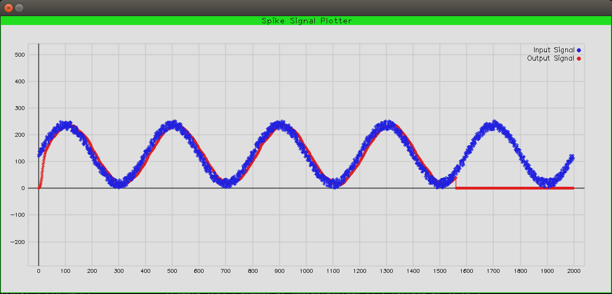

TIMA LABORATORY                
Spike with signal and image visual presentation                      
noureddine-as

Can work with a modified version of Spike (CVPlot (and OpenCV) + FIR instructions support)
https://github.com/noureddine-as/riscv-isa-sim/tree/visual-spike-v2-rocc-fir

